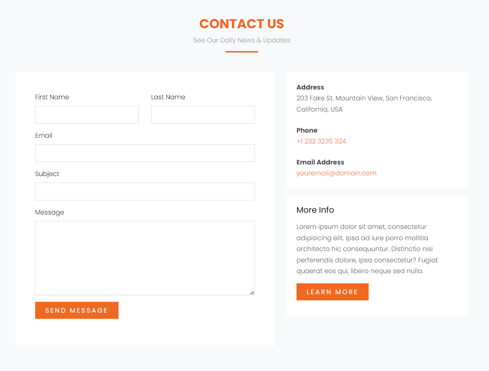

# Grid

1. https://www.w3schools.com/css/css_grid.asp
2. https://css-tricks.com/snippets/css/complete-guide-grid/

## praktika su grid

1.  toliau darom is cia https://www.w3schools.com/w3css/tryw3css_templates_blog.htm
    
2.  pasidaryti vakaryksti kazkuri daryta su flex su grid
3.  darom sita https://www.w3schools.com/w3css/tryw3css_templates_fashion_blog.htm
4.  pasidaryti kontaktu formos sekcija  https://preview.colorlib.com/theme/logis/
5.  rimtesnis, kam sunkiau pasirinkti keleta sekciju pabandyti padaryti https://preview.colorlib.com/theme/logis/
