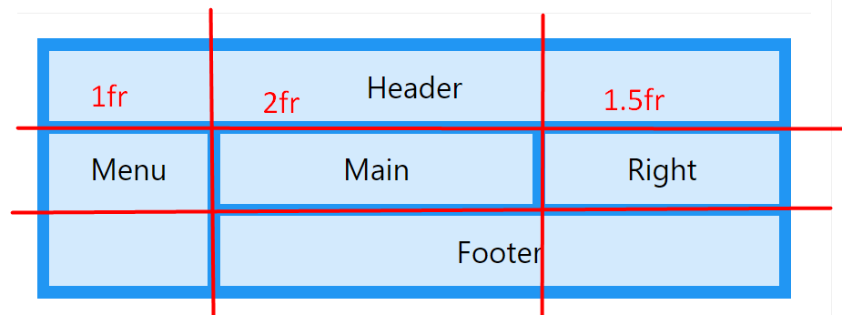

# Grid

1. https://www.w3schools.com/css/css_grid.asp
2. https://css-tricks.com/snippets/css/complete-guide-grid/
3.

## darom

1.  darom visus elementus skirtingom fono spalvom 
2.  toliau darom is cia https://www.w3schools.com/w3css/tryw3css_templates_blog.htm
    

## praktika su grid

1. pasidaryti vakaryksti kazkuri daryta su flex su grid
2. darom sita https://www.w3schools.com/w3css/tryw3css_templates_fashion_blog.htm
3. pasidaryti kontaktu formos sekcija  https://preview.colorlib.com/theme/logis/
4. rimtesnis, kam sunkiau pasirinkti keleta sekciju pabandyti padaryti https://preview.colorlib.com/theme/logis/
